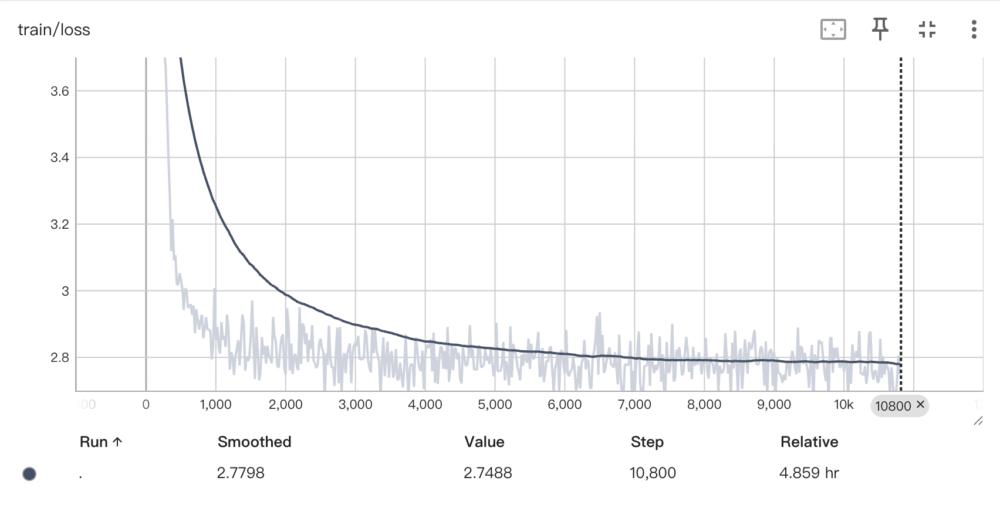
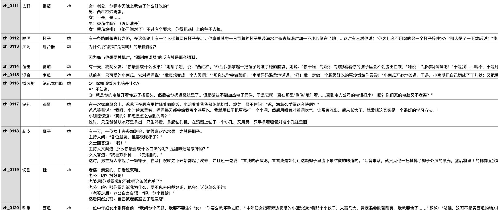
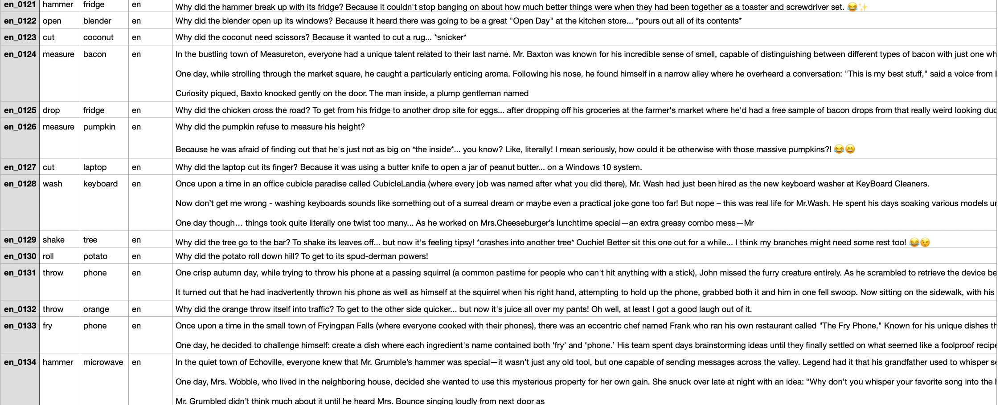
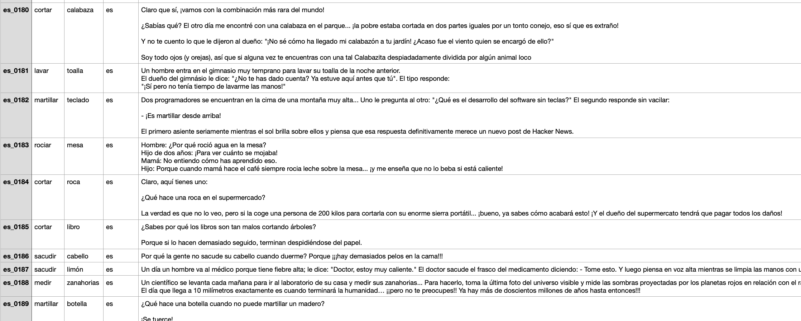
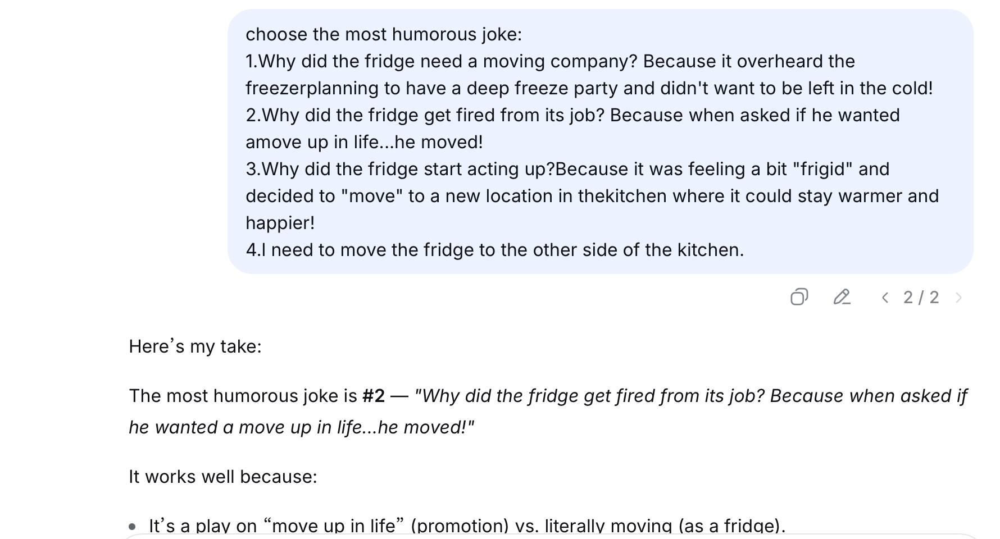

## **MSBD5018** **Result**：Project Results on Humor Generation LLM of MWAHAHA competition 

**Group member：** TONG SHUWEI( stongad@connect.ust.hk), LIANG GENMING(gliangah@connect.ust.hk)

#### 1.Model & Dataset

**Model:** This project focuses on fine-tuning the **Qwen2.5-7B** large language model (LLM) using **Low-Rank Adaptation** (LoRA) to enhance its ability to generate coherent and contextually appropriate humor content (e.g., jokes, witty responses). The dataset comprises 36,003 humor-related conversational samples, split into training (90% 32,402 samples) and validation (10% 3601 samples) sets. Key experiments include optimizing data preprocessing strategies, adjusting LoRA hyperparameters, and tuning training configurations to balance model performance and efficiency.

**Dataset:** Based on subtask A of the MWAHAHA competition website (https://pln-fing-udelar.github.io/semeval-2026-humor-gen/), we collected humor datasets in Chinese (CfunSet), English (reddit_jokes), and Spanish (CHISTES_spanish_jokes) from the internet and processed them using a LLM called **paraphrase-multilingual-MiniLM-L12-v2**. Finally, the input data was organized into TSV format by two keywords and a title.

#### 2.Model Evalution

##### 2.1 Evaluation Setup & Metrics

We have tested our model by inputting 2 Chinese/ English/ Spanish words and outputting a humorous joke. Also, we have chosen 2 beseline models to compare with our model, there are Original **Qwen2.5-7B** (pretrained on general language tasks, no humor-specific fine-tuning) and **GLM-4-9B** (pretrained, optimized for conversational generation but not specialized in humor) to have the horizontal comparioson.

Inspired by **CLoT**(https://arxiv.org/pdf/2312.02439), we develop **Top-k** choice questions to compute accuracies. For example, 5T2 question means that letting Agent choose the best two jokes among the five choices, including outputs generated by Qwen2.5-7B, GLM-4-9B and ours, as well as Ground Truth and a confusing sentence.

##### 2.2 Result 

Here is the training loss of our model:

The training loss exhibits a **clear downward trajectory**, which indicates hat the model is learning effectively from the training data—its ability to predict or generate humor-related content is improving over time.

And here are different jokes output of 3 languages, which are generated from part of MWAHAHA competition's formal testing data. The generated jokes have a relatively large word count because the jokes used for training in our training set also have a relatively large word count.

###### 2.2.1 Chinese jokes:

###### 2.2.2 English jokes:

###### 2.2.3 Spanish jokes:

we can tell the model is able to generate jokes in different languages based on the keywords given, which satisfies the goal of the competition. But what about the accuracy of jokes-generation compared with other models? Here is the comparison.

|  Model   | 5T2 Accuracy |
| :------: | :----------: |
| ground truth | 0.91 |
| confused | 0.00 |
| **Qwen2-7B** |     0.28     |
| **GLM-4-9B** |     0.05     |
|   **Ours**   |     0.76     |

Although the accuracy of this model is not significantly higher than that of other models, it indicates that there is still room for improvement. For example, in the next phase, we can optimize the input data in the sentence length, humor level and many other perspectives. What's more, Modifying training parameters to prevent overfitting is also a task to do.

And we also use DeepSeek to evaluate our model in the logic, structure, and plot of the joke, as well as whether it uses puns or other linguistic techniques. And the model we modified( generated the 2nd joke in the figure) mostly achieve the best among these 3 models.

##### 2.3 Conclusion

In conclusion, the Qwen2.5-7B model fine-tuned with LoRA represents a robust solution for humor generation, balancing efficiency, coherence, and humor quality. It outperforms both non-specialized LLMs and its own pre-fine-tuning state, making it suitable for applications like conversational AI, content creation, and entertainment platforms.

But we still have a lot to finish in our continuing job, for example, to optimize how overfitting is prevented through parameter selection, and the diversity of joke generation sentence structures is optimized.

##### 

